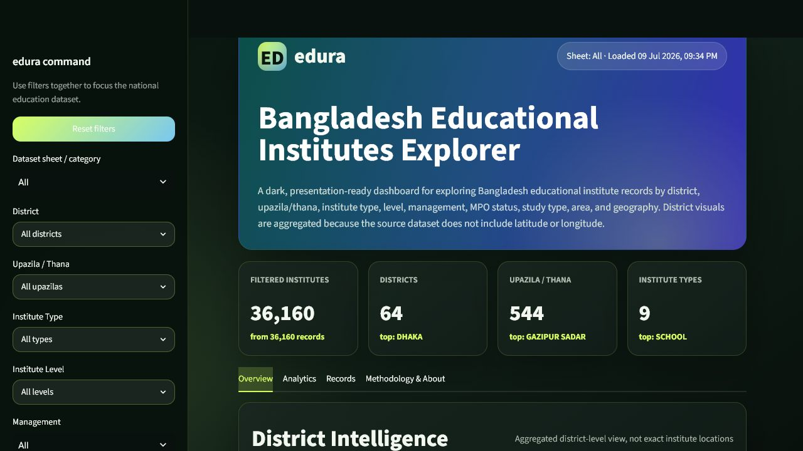
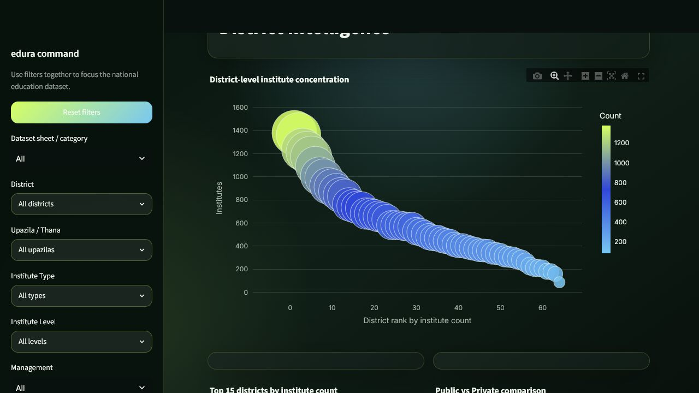
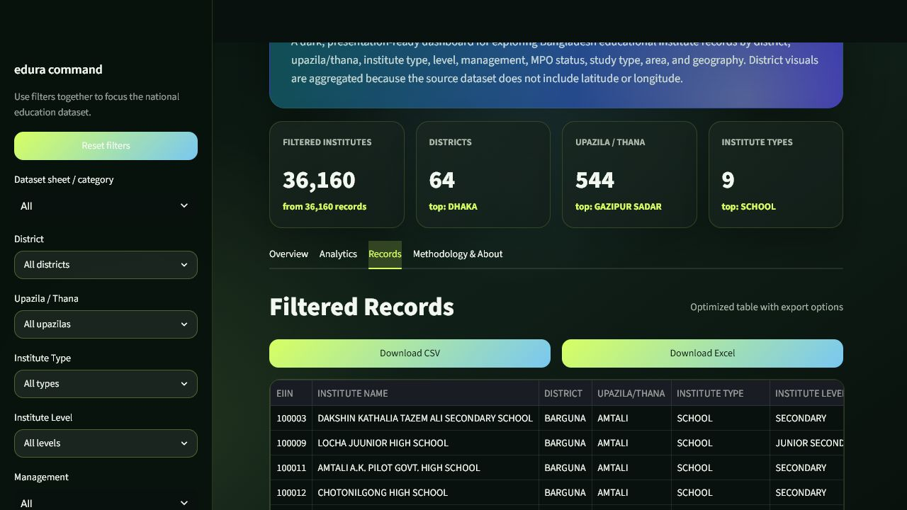
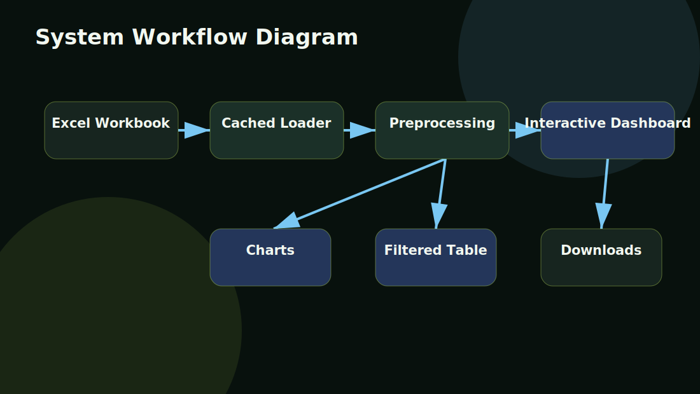

# 📊 Data Visualization Web Application


A professional, interactive Streamlit dashboard for exploring Bangladesh educational institute data. Version 2.0 adds an optional API-powered AI Data Assistant that can explain filtered results, chart patterns, district rankings, limitations, and dataset summaries using secure environment-variable configuration.

> Built for academic submission at **Daffodil International University**.

## 🌐 Live Demo

Public preview link:

[https://bd-edu-institutes-explorer-6565.netlify.app](https://bd-edu-institutes-explorer-6565.netlify.app)

The public preview includes the cleaned District Overview chart and a visible AI Assistant panel. The static preview can provide local summarized answers without storing secrets; API-backed AI answers require a user-provided OpenRouter key for the current browser session or the full Streamlit deployment with secrets.

Version 2.0 Streamlit deployment note:

The full AI-enhanced Streamlit app requires a Python host such as Streamlit Community Cloud or Render. To enable the AI assistant in production, add `OPENROUTER_API_KEY` as a deployment secret. See [Version 2 AI Setup](deployment/version_2_ai_setup.md).

## 🚀 Version 2.0 — AI-Enhanced Dashboard

The Version 2.0 update adds an AI assistant that can:

- Explain the currently filtered dataset.
- Summarize visible chart patterns.
- Identify top districts, institute types, management groups, and MPO distribution.
- Suggest useful analytical questions.
- State limitations when the data does not support a conclusion.
- Work safely with summarized dashboard context instead of the full workbook.

The app remains fully functional when no AI API key is configured.

## 🖼️ Project Preview

### Dashboard Home



### Interactive District Visualization



### Filtered Data Table



## ✨ Key Features

- Modern dark dashboard UI inspired by the provided reference theme
- Excel workbook loading with cached Streamlit data pipeline
- Sheet/category selector for all dataset sheets
- Sidebar filters for district, upazila/thana, institute type, level, management, MPO, study type, area, and geography
- Search by institute name, EIIN, address, post, district, or upazila/thana
- KPI summary cards
- District-level institute concentration visualization
- Institute type, institute level, management, MPO, study type, area, and geography charts
- Public/Government vs Private comparison
- Searchable filtered data table
- CSV and Excel download
- Institute detail view
- Dataset summary and methodology section
- Professional DOCX and PDF academic report
- Deployment guides for Streamlit Community Cloud and Render
- Optional AI Data Assistant using secure OpenRouter API configuration

## 🧾 Dataset

The dataset is stored at:

```text
data/raw/edu_institutes.xlsx
```

The workbook contains the following sheets:

| Sheet | Purpose |
|---|---|
| `All` | Main dataset used by default |
| `Schools` | School institute records |
| `Colleges` | College institute records |
| `Schools_Colleges` | Combined school-college records |
| `Madrasas` | Madrasa institute records |
| `Public Universities` | Public university records |
| `Private Universities` | Private university records |
| `Technical` | Technical institute records |
| `Professionals` | Professional institute records |
| `Teachers Training` | Teacher training institute records |

Important columns include `DISTRICT`, `UPAZILA/THANA`, `INSTITUTE TYPE`, `INSTITUTE LEVEL`, `EIIN`, `INSTITUTE NAME`, `ADDRESS`, `POST`, `MOBAILE`, `MANAGEMENT`, `MPO`, `STUDY TYPE`, `AREA`, and `GEOGRPY`.

The app safely normalizes spelling issues:

| Original Column | Display Column |
|---|---|
| `MOBAILE` | `MOBILE` |
| `GEOGRPY` | `GEOGRAPHY` |

> Note: The source dataset does not contain latitude and longitude. The dashboard therefore uses district-level aggregation and does not claim exact institution point locations.

## 🛠️ Technology Stack

| Category | Tools |
|---|---|
| Programming Language | Python |
| Web Framework | Streamlit |
| Data Processing | Pandas, NumPy |
| Excel Handling | OpenPyXL, XlsxWriter |
| Visualization | Plotly |
| AI API | OpenRouter-compatible Chat Completions |
| Documentation | Markdown, python-docx, ReportLab |
| Deployment Targets | Streamlit Community Cloud, Render |

## 🗂️ Project Structure

```text
Data-Visualization/
├── app.py
├── requirements.txt
├── README.md
├── LICENSE
├── .gitignore
├── .env.example
├── data/
│   ├── raw/
│   │   └── edu_institutes.xlsx
│   └── processed/
│       ├── dataset_summary.json
│       └── edu_institutes_cleaned.csv
├── src/
│   ├── __init__.py
│   ├── data_loader.py
│   ├── preprocessing.py
│   ├── visualizations.py
│   ├── map_utils.py
│   └── utils.py
├── assets/
│   ├── screenshots/
│   ├── figures/
│   └── diagrams/
├── report/
│   ├── Project_Report.docx
│   ├── Project_Report.pdf
│   └── report_assets/
├── deployment/
│   ├── streamlit_cloud_deployment.md
│   ├── render_deployment.md
│   └── hosting_notes.md
└── docs/
    └── user_guide.md
```

## ⚙️ Installation

Clone the repository:

```bash
git clone https://github.com/monowarkayser/Data-Visualization.git
cd Data-Visualization
```

Create and activate a virtual environment:

```bash
python -m venv .venv
```

Windows:

```bash
.venv\Scripts\activate
```

macOS/Linux:

```bash
source .venv/bin/activate
```

Install dependencies:

```bash
pip install -r requirements.txt
```

## 🤖 AI API Configuration

The AI assistant uses environment variables. Never commit real API keys.

1. Copy `.env.example` to `.env`.
2. Add your private key:

```text
OPENROUTER_API_KEY=your_private_key_here
OPENROUTER_MODEL=openrouter/free
```

3. Run the app normally:

```bash
streamlit run app.py
```

If the key is missing or invalid, the dashboard still works and the AI tab shows a setup message.

## ▶️ Run Locally

```bash
streamlit run app.py
```

Then open:

```text
http://localhost:8501
```

## 📘 Usage Instructions

1. Open the app in a browser.
2. Choose the dataset sheet/category from the sidebar.
3. Apply one or more filters.
4. Use search to find an institute by EIIN, name, address, post, district, or upazila/thana.
5. Explore KPI cards, charts, district aggregation, and filtered records.
6. Download filtered results as CSV or Excel.
7. Open the methodology section for dataset and preprocessing notes.

## 🔁 Project Workflow



Additional diagrams:

- [Data Processing Workflow](assets/diagrams/data_processing_workflow.svg)
- [User Interaction Flowchart](assets/diagrams/user_interaction_flowchart.svg)
- [Application Architecture](assets/diagrams/app_architecture.svg)

## 📚 Documentation

| Document | Link |
|---|---|
| Project Report PDF | [report/Project_Report.pdf](report/Project_Report.pdf) |
| Project Report DOCX | [report/Project_Report.docx](report/Project_Report.docx) |
| User Guide | [docs/user_guide.md](docs/user_guide.md) |
| Version 2 AI Setup | [deployment/version_2_ai_setup.md](deployment/version_2_ai_setup.md) |
| Streamlit Cloud Deployment | [deployment/streamlit_cloud_deployment.md](deployment/streamlit_cloud_deployment.md) |
| Render Deployment | [deployment/render_deployment.md](deployment/render_deployment.md) |
| Hosting Notes | [deployment/hosting_notes.md](deployment/hosting_notes.md) |

## 🚀 Deployment

### Streamlit Community Cloud

1. Push this repository to GitHub.
2. Open Streamlit Community Cloud.
3. Select this repository.
4. Set the main file path to:

```text
app.py
```

5. Deploy.

### Render

Build command:

```bash
pip install -r requirements.txt
```

Start command:

```bash
streamlit run app.py --server.port=$PORT --server.address=0.0.0.0
```

## 🔒 Security Notes

- No password, token, API key, or private credential is stored in this repository.
- `.env` is ignored by Git.
- `.env.example` is included only as a safe template.
- Deployment secrets should be added through hosting provider secret managers.
- The AI assistant sends summarized dashboard context only, not the full dataset.

## 🔮 Future Improvements

- Add official Bangladesh district GeoJSON for a true district choropleth
- Add EIIN and mobile format validation
- Add chart image export
- Add user-uploaded dataset support
- Add authenticated private deployment mode
- Add automated tests for preprocessing and filtering
- Add provider selection for multiple AI APIs

## 👤 Author

| Field | Information |
|---|---|
| Name | S. M. Monowar Kayser |
| University | Daffodil International University |

## 📄 License

This project is released under the MIT License. See [LICENSE](LICENSE) for details.
